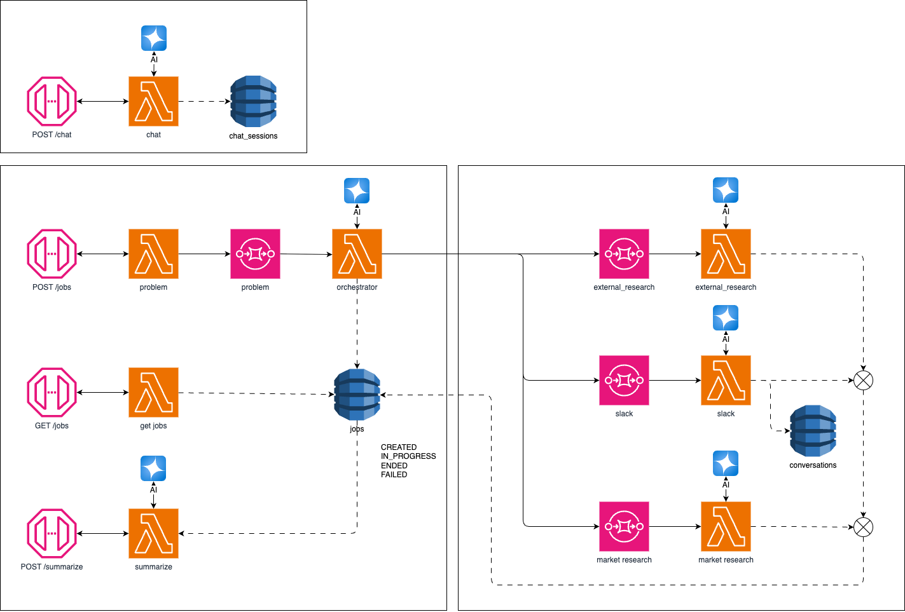

# GreenLight - Plataforma de Validación de Ideas con IA

## 📋 Descripción General

**GreenLight** es una plataforma web de investigación y validación de ideas de negocio impulsada por inteligencia artificial. Funciona como un equipo de consultoría virtual que analiza problemas en profundidad, identifica obstáculos, evalúa el mercado, estudia la competencia, revisa el marco legal y genera un documento ejecutivo completo listo para la toma de decisiones.

El objetivo principal es evitar que emprendedores y equipos de producto **gasten de más**, **prioricen mal** o **pierdan tiempo** en ideas no validadas, proporcionando insights críticos antes de invertir recursos significativos.

---

## 🎯 Propuesta de Valor

- **Investigación Profunda Automatizada**: Múltiples agentes de IA especializados analizan diferentes aspectos del problema de manera simultánea
- **Conversación Inteligente**: Sistema de chat que profundiza en el problema mediante preguntas progresivas hasta identificar el problema raíz
- **Validación 360°**: Análisis de obstáculos técnicos, soluciones existentes, competidores, marco legal y oportunidades de mercado
- **Documento Ejecutivo**: Generación automática de un resumen en formato Markdown exportable con todos los hallazgos

---

## 🏗️ Arquitectura del Proyecto




## 🔄 Flujo de Usuario

### 1. **Identificación del Problema** (`/`)
- Landing page con input principal
- Animación de texto rotativo mostrando problemas comunes
- Usuario ingresa su problema o idea inicial
- Guardado en localStorage y navegación a `/conversation`

### 2. **Conversación y Refinamiento** (`/conversation`)
- Chat conversacional con sistema de IA
- Barra de progreso dinámica (temperatura 0-7) que indica profundidad del problema
- Sistema hace preguntas progresivas para entender el problema raíz
- Cuando temperatura >= 6: se ofrece opción de sintetizar o seguir refinando
- Síntesis editable del problema antes de continuar
- Gestión de `session_id` en URL params para persistencia

**Características del Chat:**
- Mensajes con formato Markdown (asistente)
- Textarea auto-expandible
- Indicador de escritura animado
- Opción de limpiar conversación
- Scroll automático a último mensaje

### 3. **Investigación Paralela** (`/jobs`)
- Creación automática de múltiples jobs de investigación
- Polling cada 10 segundos para actualizar estados
- Categorización en 3 secciones:
  - **Investigación de Mercado**: Deep research, análisis de datos
  - **Investigación Interna**: Consultas a Slack
  - **Investigación Externa**: Búsqueda de expertos, contacto por email

**Tipos de Jobs:**
- `research` / `market_research`: Investigación web profunda
- `external_research`: Identificación de expertos
- `slack`: Consulta a equipo interno
- `data`: Análisis de datos históricos

**Estados de Jobs:**
- `CREATED` / `pending`: Pendiente
- `IN_PROGRESS` / `in_progress`: En progreso
- `COMPLETED` / `completed`: Completado
- `FAILED` / `failed`: Fallido

**Visualización de Resultados:**
- Cards expandibles por tipo de investigación
- Componentes especializados:
  - `ResearchResults`: Muestra obstáculos, soluciones, competidores, marco legal, mercado
  - `ExternalResearchResults`: Muestra perfil de experto, estrategia de búsqueda, lista de expertos

### 4. **Documento Ejecutivo** (`/summary`)
- Síntesis final generada por IA
- Renderizado con Tailwind Typography (prose classes)
- Formato Markdown con headers, listas, texto en negrita
- Botón de exportación a archivo `.md`
- Diseño limpio con tipografía personalizada

---

## 📊 Flujo de Datos

```
1. Usuario ingresa problema → Homepage
2. Mensaje guardado en localStorage
3. Navegación a /conversation con session_id en URL
4. Chat bidireccional con backend
5. Temperatura aumenta progresivamente
6. Síntesis del problema (editable)
7. POST /jobs crea múltiples investigaciones paralelas
8. Polling cada 10s actualiza estados
9. Resultados mostrados en cards expandibles
10. POST /summarize genera documento final
11. Usuario puede exportar .md
```
